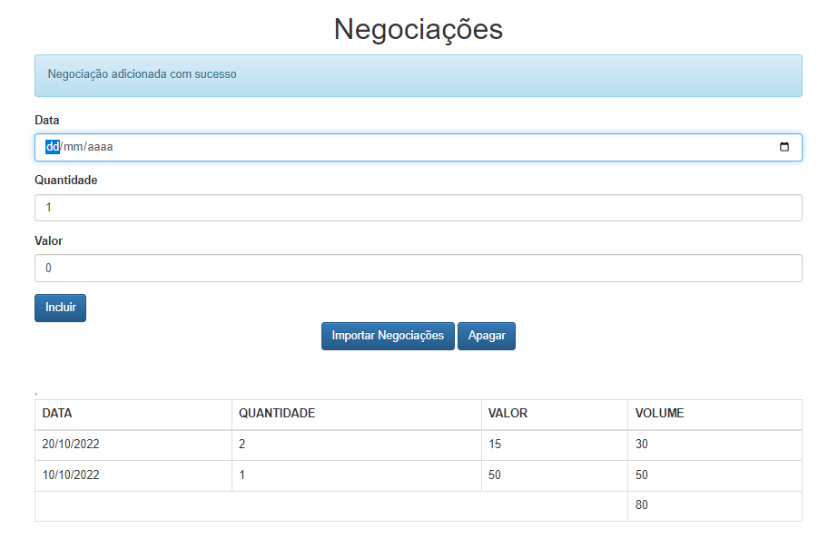

<h1 align="center"> JS-NEGOCIAÇÕES</h1>

Aplicação desenvolvida em Javascript durante o curso <a href="https://cursos.alura.com.br/course/javascript-es6-orientacao-a-objetos-parte-1">Javascript: conhecendo o Browser e padrões de projeto</a>, da Alura.

  <a href="#-tecnologias">Tecnologias</a>&nbsp;&nbsp;&nbsp;|&nbsp;&nbsp;&nbsp;
  <a href="#-projeto">Projeto</a>&nbsp;&nbsp;&nbsp;|&nbsp;&nbsp;&nbsp;
  <a href="#-layout">Layout</a>&nbsp;&nbsp;&nbsp;|&nbsp;&nbsp;&nbsp;
  <a href="#memo-licença">Licença</a>

  

 

  

## 🚀 Tecnologias

Esse projeto foi desenvolvido com as seguintes tecnologias:

- HTML e CSS
- JavaScript
- Bootstrap
 
 

## 💻 Projeto

Aplicação em Javascript que permite cadastrar negociações. Seu ponto forte é a prática de vários conceitos de orientação a objetos, utilizando a estrutura MVC.
 
 

## 🔖 Layout

Você pode visualizar o layout do projeto através [DESSE LINK](https://www.figma.com/file/gpqavL469k0pPUGOmAQEM9/Explorer-Lab-%2301/duplicate). É necessário ter conta no [Figma](https://figma.com) para acessá-lo.
 
 

## :memo: Licença

Esse projeto está sob a licença MIT.

---

Feito com ♥ by Luiiz
